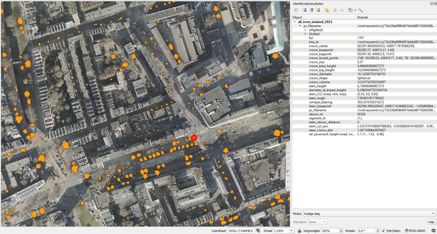

# 🌿 rdam_green_space_monitoring — End-to-End Urban Green Space Monitoring Pipeline

<p align="center">
  
</p>

*Animated workflow: extracting, segmenting, and measuring trees from point-cloud data.*

`rdam_green_space_monitoring` is the **umbrella repository** for Rotterdam’s full **LiDAR-based green-space monitoring pipeline**.  
It orchestrates the complete workflow—from raw pointclouds to per-tree 3D geometry, metrics, and urban-context analytics—by integrating several modular subpackages.

This system provides:

- **Point cloud preparation & asset extraction** (tiling, ground filtering, BGT assets, 2D raster prompts),
- **2D/3D tree segmentation** using configurable prompting,
- **3D pointcloud operations** (mask→3D conversion, clustering, slice analyses),
- **Tree geometry modeling** (stem/crown reconstruction, metrics, crown–pavement interactions),
- **Pipeline configurations & component definitions** for cloud-scale execution.

This repository bundles the following package repos (also available in `lib/`):

- 🌐 **[`pc_prep`](https://github.com/Municipality-of-Rotterdam/pc_prep)** — point-cloud tiling, preprocessing & rasterization  
- 🎨 **[`pc_segment`](https://github.com/Municipality-of-Rotterdam/pc_segment)** — 2D segmentation & prompting  
- 🧩 **[`pc_ops`](https://github.com/Municipality-of-Rotterdam/pc_ops)** — 3D operations & geometry extraction  
- 🌳 **[`tree_modeling`](https://github.com/Municipality-of-Rotterdam/tree_modeling)** — 3D tree reconstruction & metric computation  

Together, these components form a **scalable, modular analysis suite** for mapping and monitoring Rotterdam’s urban green infrastructure.

<p align="center">
  
</p>

*Example output file after running the whole pipeline. It shows tree segments (orange polygons) with measurements as attributes (table on the right).*

### Packages

#### pc_prep

The **pointcloud preparation package** (`pc_prep`) prepares raw pointcloud tiles for the later steps of the pipeline.  
It performs among others tiling and segmentation of pointclouds, and rasterization of 3D data into 2D representations that can be used for downstream 2D segmentation.  

| BGT pavement assets and trees | Pointcloud tile top view |
|-------------------------------|---------------------------|
|  |  |

| Pointcloud converted to 2D raster | Pointcloud tile with asset segments |
|----------------------------------|-------------------------------------|
|  |  |

---

#### pc_segment

The **segmentation package** (`pc_segment`) segments 3D objects (such as trees) from the rasterized (2D) pointcloud tiles.  
It supports configurable prompting and inference to generate segmentation masks that identify features of interest.  

| Prompted image | Predicted masks |
|----------------|------------------|
|  |  |

---

#### pc_ops

The **pointcloud operations package** (`pc_ops`) performs geometric and analytical operations on segmented pointclouds.  
This includes converting 2D masks back into 3D segments, filtering noise and other pointcloud operations like connected component clustering and region growing.  

| Predicted masks | Masks converted to 3D |
|-----------------|------------------------|
|  |  |

| Tree slices | Tree slices filtered |
|-------------|----------------------|
|  |  |

---

#### tree_modeling

The **tree modeling package** (`tree_modeling`) reconstructs tree geometries from the processed pointcloud data.  
It generates 3D meshes of tree crowns and stems, computes metrics, finds collisions between trees and pavement zones, and provides outputs suitable for visualization and analysis.  

| Tree pointcloud | Crown mesh | Crown + stem mesh |
|-----------------|------------|-------------------|
|  |  |  |

---

### Subpackages

#### CloudComPy
The package `pc_ops` makes use of **CloudComPy**, a Python wrapper for CloudCompare.  
To install CloudComPy (used for clustering trees using connected components), follow the instructions in `CloudComPy_installation.md` in the `pc_ops` repo.

#### AdTree
The package `tree_modeling` makes use of **AdTree**, a custom library for detailed tree modeling.  
See the `tree_modeling` repository for instructions on installation and usage.

---

## Data preparation

Before running the pipeline, prepare the input data as follows:

- **pc_raw** — directory containing raw pointcloud tiles in `.laz` format  
  Uses Cyclomedia naming conventions:  
  filenames like `filtered_xxxx_xxxx.laz` inside directories like `nl-rott-yymmdd-areacode-laz`.
- **pc_raw_metadata** — `.gpkg` file containing polygon geometries for pointcloud tile bounds  
- **tree_df_path** — `.pkl` file with point geometries for trees to process (defines subset of tiles)  
- **reference_trees_path** — `.pkl` file with reference tree geometries (optional, for comparison)  
- **bgt_pavements_raw** — `.gpkg` file with polygon geometries of BGT assets to segment  
  Processes pavement and greenery classes defined in the `KLASSE` column.  
  For class configuration, see `src/pc_prep/pavement_prep/config.py`.

---

## Azure Machine Learning Pipeline Execution Guide

Below is an example of how the code could be run as a pipeline when using Azure
Machine Learning.

Note that we provide the code for building components and orchestrating
pipelines, but we do not enable CI/CD for automation of this procedure.

Each submodule or package repository has its own Azure Machine Learning
(AML) component.
The component's content follows the package's repository directly; it
expects an Azure Machine Learning environment with said package as
dependency.
Note that we again do not enable CI/CD for automation of this procedure.


The pipeline can be executed using either **parallel** or **serial**
compute:

-   Use **parallel** execution for large-scale jobs (e.g. \>1000 tiles
    such as the entire city of Rotterdam).
-   Use **serial** execution for smaller datasets or debugging.

For serial processing, there is one component per package.
For parallel processing, for `pc_prep`, `pc_segment`, and `tree_modeling`, the pipeline consists of:
- A *plan items* component  
- A *parallel run* task  
- A *merge items* component  

For `pc_ops`, it includes:
- An *MPI-distributed* component  
- A *merge* component


*Figure: Azure Machine Learning pipeline showing data flow and component
dependencies for serial processing.*

### Steps to Prepare and Run the Pipeline

1.  **Create an Azure Machine Learning environment for the package**

    From the corresponding *package* repository (e.g. `pc_ops`,
    `pc_prep`, etc.), build and register an AML environment that has the
    package as a dependency.

    ``` bash
    az ml environment create -f aml_environment.yml
    ```
    NOTE: the image should be updated with the Dockerfile specified.

    NOTE 2: the package still needs to be build.

2.  **Create or update the Azure Machine Learning component for this
    repo**

    In the *current* repository, create or update the AML component
    referencing the environment created above.
    E.g., in case of serial processing:

    ``` bash
    az ml component create -f aml_deployments/pc_prep/pc_prep.yml
    ```

3.  **Fill in the pipeline parameters in your YAML file** based on\
    `aml_deployments/pipeline.yml` (serial) or
    `aml_deployments/pipeline_parallel.yml` (parallel).

4.  **Execute the pipeline using Azure ML CLI:**

    ``` bash
    az ml job create -f YOUR_FILLED_PIPELINE.yml
    ```

5.  **Optionally, tag your run with specific package versions:**

    ``` bash
    az ml job create --file pipeline_filled.yml --set tags.pkg_version_pc_prep=0.1.1 --set tags.pkg_version_pc_segment=2.0.11  --set tags.pkg_version_pc_ops=2.1.0 --set tags.pkg_version_tree_modeling=2.1.2
    ```

---


*Figure: High-level overview of the Azure ML pipeline architecture.*

---

## 👥 Authors & Contact

Developed by the **City of Rotterdam** for urban point cloud analyses.

---