# rdam_green_space_monitoring

  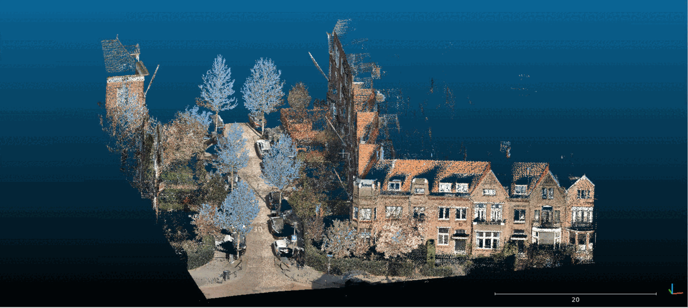

*Figure: Animated visualization of tree extraction and measurements from pointcloud data.*

This repository provides an end-to-end pipeline for preparing, segmenting, processing, and modeling tree data from pointclouds.  
It includes multiple modular packages that handle data preprocessing, segmentation, pointcloud operations, and tree modeling.  
It contains all package repos, component definitions, and pipeline configurations to run the whole green space monitoring analysis.

The project consists of the following package_repos (see also the lib/ folder):  
[pc_prep](https://github.com/Municipality-of-Rotterdam/pc_prep)  
[pc_segment](https://github.com/Municipality-of-Rotterdam/pc_segment)  
[pc_ops](https://github.com/Municipality-of-Rotterdam/pc_ops)  
[tree_modeling](https://github.com/Municipality-of-Rotterdam/tree_modeling)

### Packages

#### pc_prep

The **pointcloud preparation package** (`pc_prep`) prepares raw pointcloud tiles for the later steps of the pipeline.  
It performs among others tiling and segmentation of pointclouds, and rasterization of 3D data into 2D representations that can be used for downstream 2D segmentation.  

| BGT pavement assets and trees | Pointcloud tile top view |
|-------------------------------|---------------------------|
| 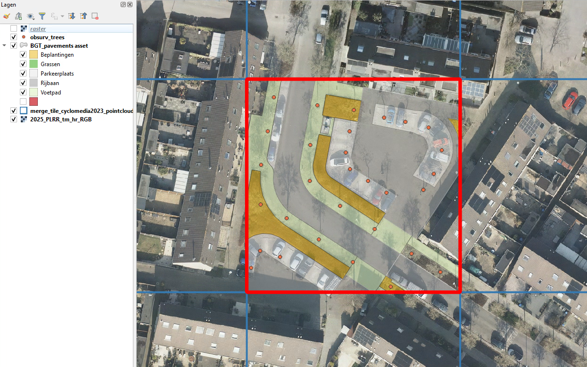 | 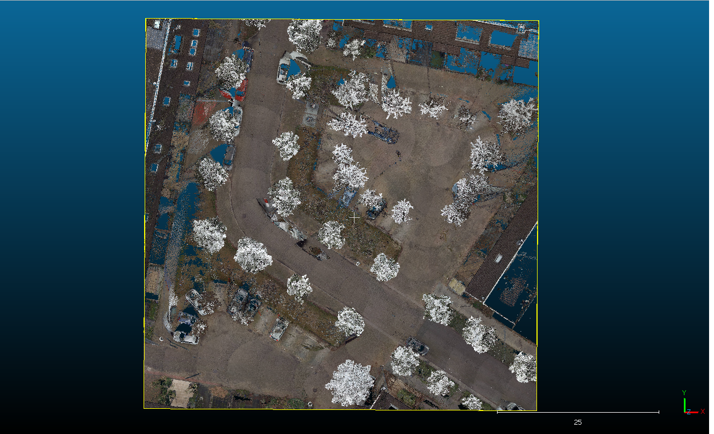 |

| Pointcloud converted to 2D raster | Pointcloud tile with asset segments |
|----------------------------------|-------------------------------------|
| 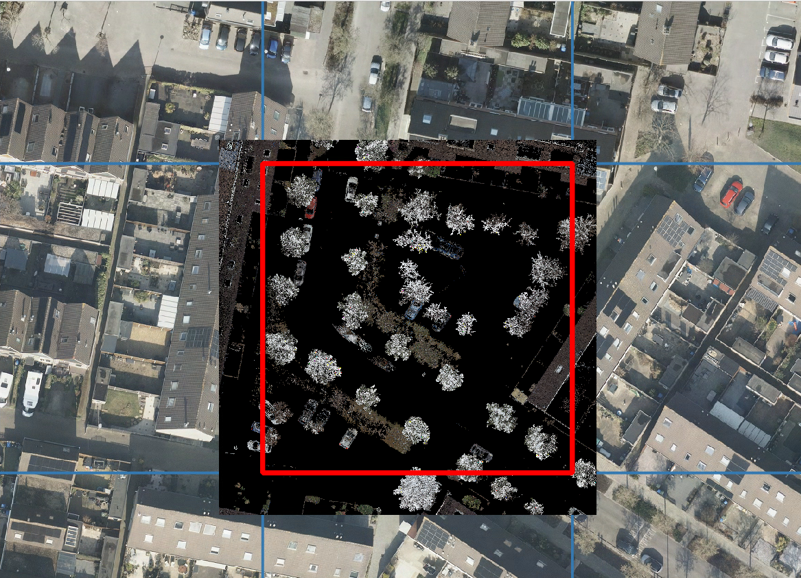 |  |

---

#### pc_segment

The **segmentation package** (`pc_segment`) segments 3D objects (such as trees) from the rasterized (2D) pointcloud tiles.  
It supports configurable prompting and inference to generate segmentation masks that identify features of interest.  

| Prompted image | Predicted masks |
|----------------|------------------|
| 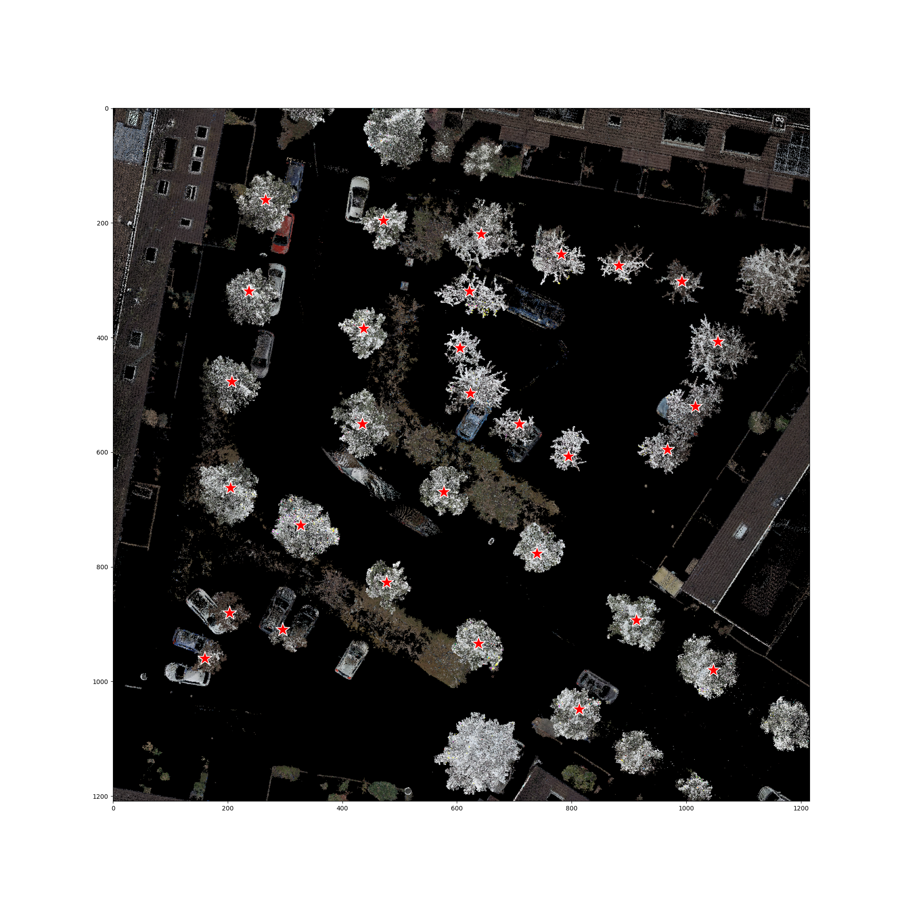 | 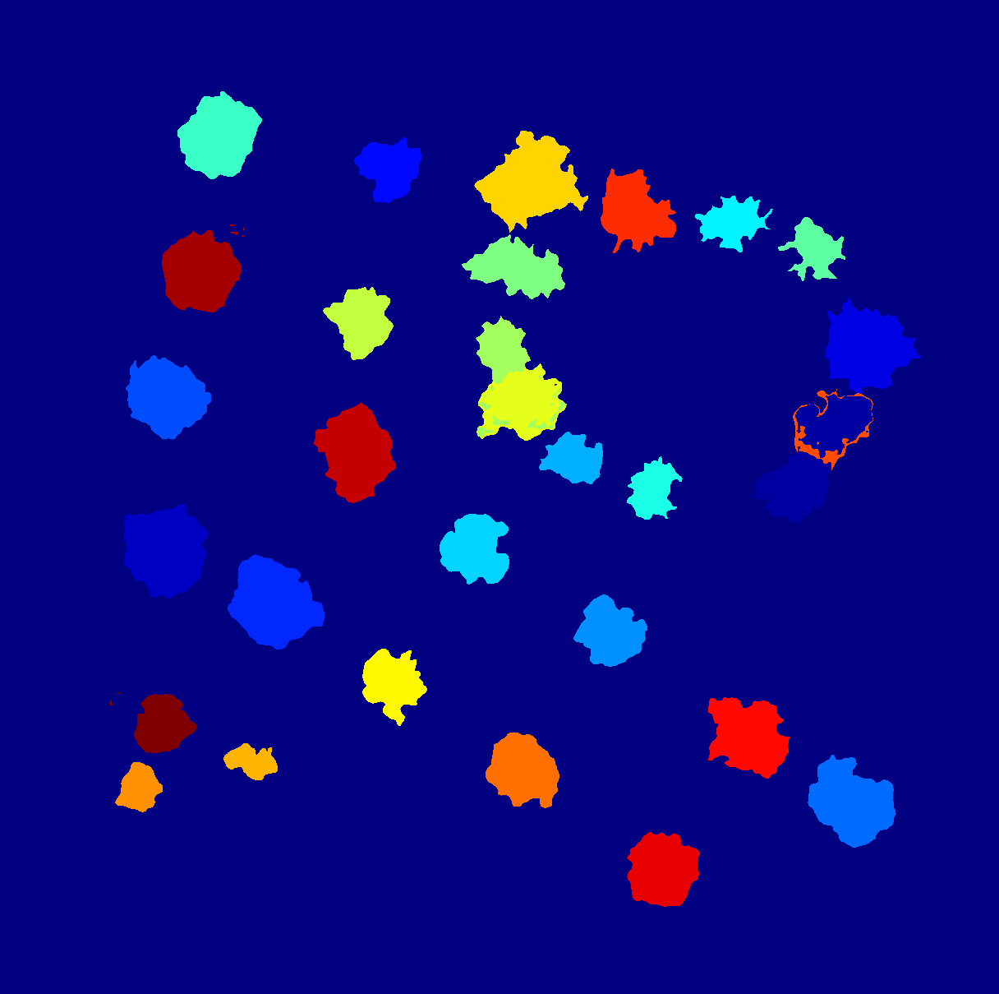 |

---

#### pc_ops

The **pointcloud operations package** (`pc_ops`) performs geometric and analytical operations on segmented pointclouds.  
This includes converting 2D masks back into 3D segments, filtering noise and other pointcloud operations like connected component clustering and region growing.  

| Predicted masks | Masks converted to 3D |
|-----------------|------------------------|
|  | 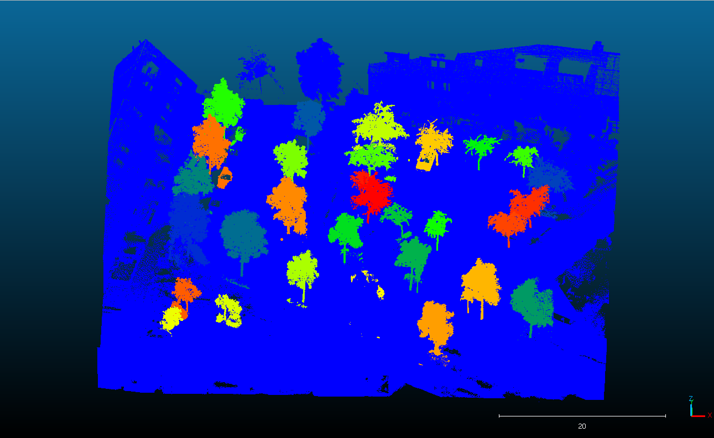 |

| Tree slices | Tree slices filtered |
|-------------|----------------------|
| 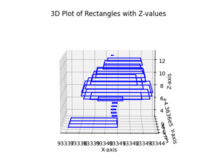 | 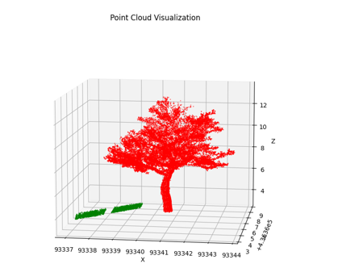 |

---

#### tree_modeling

The **tree modeling package** (`tree_modeling`) reconstructs tree geometries from the processed pointcloud data.  
It generates 3D meshes of tree crowns and stems, computes metrics, finds collisions between trees and pavement zones, and provides outputs suitable for visualization and analysis.  

| Tree pointcloud | Crown mesh | Crown + stem mesh |
|-----------------|------------|-------------------|
| 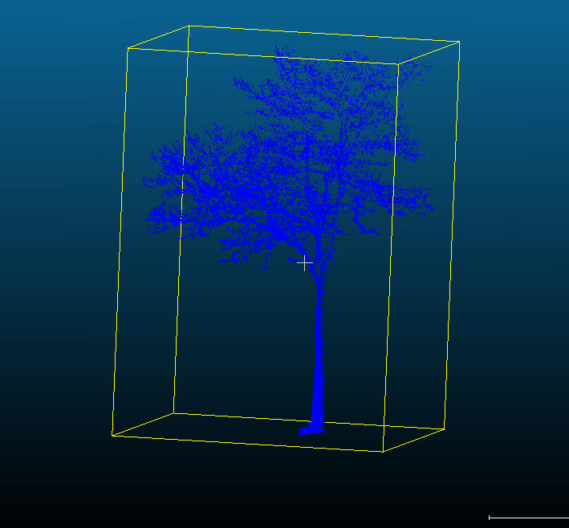 |  | 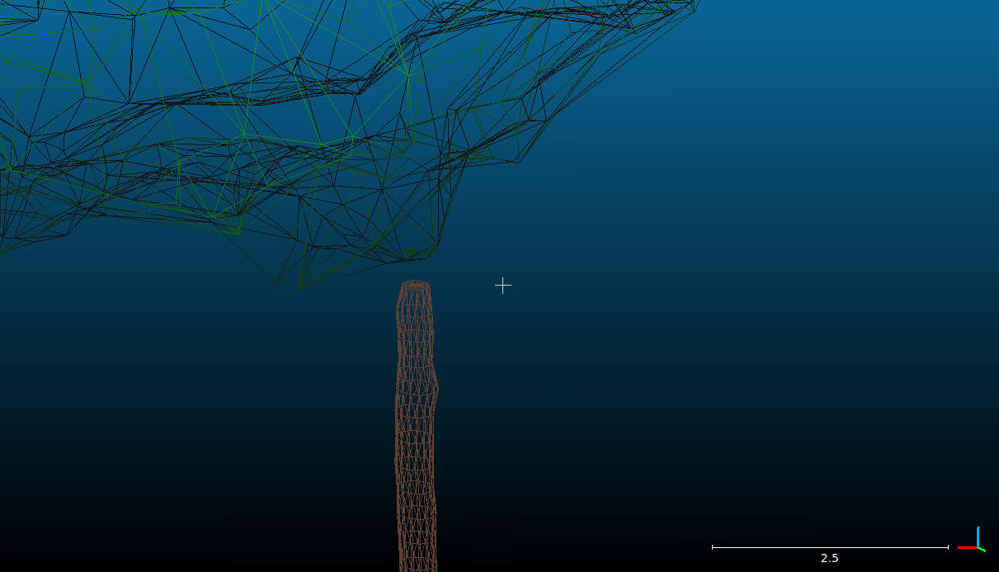 |

---

### Subpackages

#### CloudComPy
The package `pc_ops` makes use of **CloudComPy**, a Python wrapper for CloudCompare.  
To install CloudComPy (used for clustering trees using connected components), follow the instructions in  
[`lib/pc_ops/CloudComPy_installation.md`](lib/pc_ops/CloudComPy_installation.md).

#### AdTree
The package `tree_modeling` makes use of **AdTree**, a custom library for detailed tree modeling.  
See the `tree_modeling` repository for instructions on installation and usage.

---

## Data preparation

Before running the pipeline, prepare the input data as follows:

- **pc_raw** — directory containing raw pointcloud tiles in `.laz` format  
  Uses Cyclomedia naming conventions:  
  filenames like `filtered_xxxx_xxxx.laz` inside directories like `nl-rott-yymmdd-areacode-laz`.
- **pc_raw_metadata** — `.gpkg` file containing polygon geometries for pointcloud tile bounds  
- **tree_df_path** — `.pkl` file with point geometries for trees to process (defines subset of tiles)  
- **reference_trees_path** — `.pkl` file with reference tree geometries (optional, for comparison)  
- **bgt_pavements_raw** — `.gpkg` file with polygon geometries of BGT assets to segment  
  Processes pavement and greenery classes defined in the `KLASSE` column.  
  For class configuration, see `src/pc_prep/pavement_prep/config.py`.

---

## Run pipeline with cloud provider

Below is an example of how the code could be run when using Azure Machine Learning.
Note that the code for this orchestration is not included in the repository.

  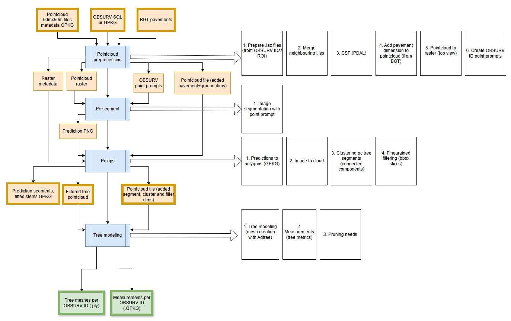

*Figure: High-level overview of the Azure ML pipeline architecture.*

The pipeline can be executed using either **parallel** or **serial** compute:

- Use **parallel** execution for large-scale jobs (e.g. >1000 tiles such as the entire city of Rotterdam).  
- Use **serial** execution for smaller datasets or debugging.

  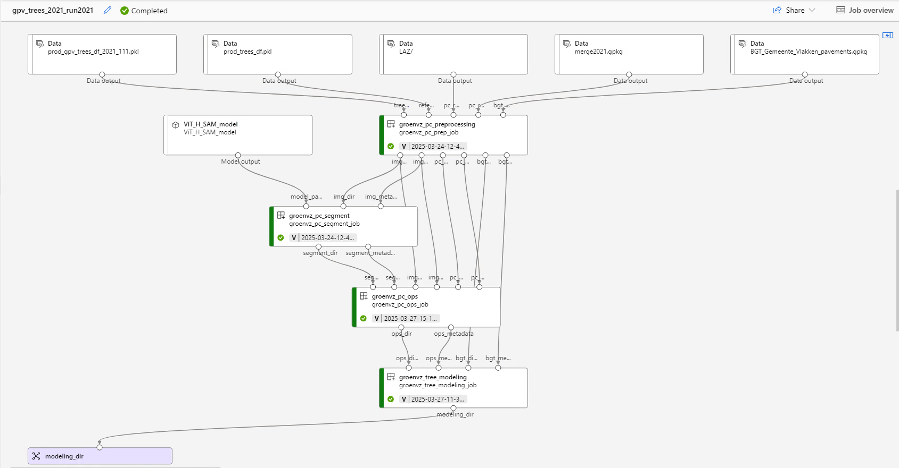

*Figure: Azure Machine Learning pipeline showing data flow and component dependencies.*

